Loop, Equipment Sizing and other Design Data
============================================

The importance of correct equipment sizing is often ignored in discussions of building simulation methods. The lack of reliable, efficient and flexible sizing calculations can present a serious barrier to the adoption and acceptance of building simulation programs. This section describes the sizing methodology implemented in EnergyPlus. This method includes:

1.  A zone by zone heat balance load and air-flow calculation for multiple design days;
2.  Significant user control with modest input requirements;
3.  Zone, system and plant level calculations of design heating and cooling capacities and fluid flow rates;
4.  Modular, component-specific sizing algorithms for each HVAC component.

Sizing Manager
--------------

The sizing calculations in EnergyPlus are managed by a sizing manager contained in the software module *SizingManager*. The main sizing manager routine *ManageSizing* is called from *ManageSimulation* before the annual simulation sequence is invoked. *ManageSizing* performs the following tasks.

1.  By calling *GetSizingParams*, *GetZoneSizingInput*, *GetSystemSizingInput* and *GetPlantSizingInput* reads in all the user sizing input contained in objects *Sizing:Parameters*, *Sizing:Zone*, *Sizing:System* and *Sizing:Plant*. These objects and their data are described in the EnergyPlus Input Output Reference, Group – Design Objects.
2.  Set the *ZoneSizingCalc* flag equal to *true*.
3.  Loop over all the sizing periods by each day. **This starts the zone design calculations.**
    1.  Call *UpdateZoneSizing(BeginDay)* to initialize zone design load and flow rate  sequences.
    2.  Loop over hours in the day
        1.  Loop over zone time steps in each hour
            1.  Call *ManageWeather* to obtain outside conditions for this time-step.
            2.  Call *ManageHeatBalance* to do a full heat balance calculation for each zone. The call to *ManageHeatBalance* also brings about an HVAC simulation. *ZoneSizingCalc = true* signals the *HVACManager* to ignore the real HVAC system and instead run the ideal zonal system (described below) used to calculate design loads and flow rates. HVACManager also calls *UpdateZoneSizing(DuringDay)* to save the results of the ideal zonal system calculation in the design load and flow rate sequences.

    3.  Call *UpdateZoneSizing(EndDay)* to calculate peaks and moving averages from the zone design sequences for each design day.

4.  Call *UpdateZoneSizing(EndZoneSizingCalc)* to calculate for each zone the peak heating & cooling loads and flow rates over all the sizing periods (design days and sizing periods from the weather file, if specified). The corresponding design load and flow rate sequences are saved for use in the system design calculations. **This ends the zone design calculations.**
5.  Set the *SysSizingCalc* flag equal to *true*.
6.  Call *ManageZoneEquipment* and *ManageAirLoops* to read in the zone and central system inputs needed for the system design calculations. The program needs enough information to be able to figure out the overall air loop connectivity.
7.  Loop over all the sizing periods by each day. **This starts the system design calculations.**
    1.  Call *UpdateSysSizing(BeginDay)* to initialize system design load and flow rate  sequences.
    2.  Loop over hours in the day
        1.  Loop over zone time steps in each hour
            1.  Call *ManageWeather* to obtain outside conditions for this time-step.
            2.  Call *UpdateSysSizing(DuringDay)* to save the results of the system design calculations in the system design load and flow rate sequences.

    3.  Call *UpdateSysSizing(EndDay)* to calculate peaks and moving averages from the system design sequences for each sizing period.

8.  Call *UpdateSysSizing(EndSysSizingCalc))* to calculate for each system the peak heating & cooling loads and flow rates over all the sizing periods (design days and sizing periods from the weather file, if specified). The corresponding design load and flow rate sequences are saved for use in the component sizing calculations. **This ends the system design calculations.**
9.  **And this ends the tasks of the Sizing Manager.**

Zone Design Loads and Air Flow Rates
------------------------------------

### Overview

There is no single best way to establish design HVAC flow rates and size HVAC equipment. Different building designs, climates, and HVAC systems will impose varying constraints on the designer. The method used to size an HVAC system in a hot, moist climate such as Miami will be different than the method used for a building in Albuquerque. The type of building is also relevant – a simple watts per square foot loads estimate could be adequate for a building containing a network server farm while a detailed, dynamic loads simulation would be necessary for a passive solar building. In the end the designer’s experience and engineering judgement will play an important role in any sizing calculation.

HVAC equipment sizing begins with the calculation of space heating and cooling loads. A space cooling  (heating) load is defined as the rate at which heat must be removed (added) to a space to maintain a constant temperature. The current industry standard method for calculating space loads is the *heat balance method*  [ASHRAE Fundamentals (2001), page 29.1; Pedersen et al., (1997); Pedersen (2001). Since EnergyPlus is a heat balance based simulation program it is straightforward for the program to use this method for calculating zone loads.

### Zone Design Data Arrays

The zone design data arrays are:

*ZoneSizingInput(i)* stores the input data from the Sizing:Zone ** objects.

*CalcZoneSizing(i,j)* stores the results of the zone design calculations for all zones and all design days. The index i is for the controlled zones, j for design days.

*CalcFinalZoneSizing(i)* stores the results of the zone design calculations for the peak heating and cooling cases for each zone. The index i is for the controlled zones.

*ZoneSizing(i,j)* corresponds to *CalcZoneSizing* but includes the effect of the user specified sizing factor or user specified zone design flow rate.

*FinalZoneSizing(i)* corresponds to *CalcFinalZoneSizing* but includes the effect of the user specified sizing factor or user specified zone design flow rate.

The data stored in *CalcZoneSizing*, *CalcFinalZoneSizing*, *ZoneSizing* and *FinalZoneSizing* includes the following data items.

 

Table 37.  Zone Sizing Data

<table>
<colgroup>
<col width="50%" />
<col width="50%" />
</colgroup>
<tbody>
<tr class="odd">
<td align="left">
Name

Description
</td>
<td align="left">
All the data from <em>ZoneSizingInput</em>

 
</td>
</tr>
</tbody>
</table>

 

### Zone Design Load Calculation

As described in the preceding section, the Sizing Manager initiates the zone design calculation by looping over all of the design days and calling the Heat Balance Manager for each zone time-step in each design day. The Heat Balance manager then causes the HVAC Manager to be called in a manner identical to a normal simulation. The *ZoneSizingCalc* set to *true* signals the HVAC Manager to ignore the actual HVAC system and instead calculate the design zone loads and air flow rates using an ideal zonal system.

In module *HVACManager*, subroutine *ManageHVAC* calls *SimHVAC*. *SimHVAC* checks *ZoneSizingCalc*. If it is *true*, *SimHVAC* calls *ManageZoneEquipment* and returns, rather than simulating the actual system. In turn *ManageZoneEquipment* checks if *ZoneSizingCalc* is *true*; if it is it calls *SizeZoneEquipment* rather than *SimZoneEquipment*.

*SizeZoneEquipment* assumes that each controlled zone is served by an ideal air conditioning unit. This unit supplies heating or cooling air at a fixed, user input temperature and humidity (specified in the Sizing:Zone objects). The units have infinite capacity – the flow rate can be any amount. The calculation steps are as follows.

1.  Loop over all the controlled zones.
2.  If the system is active (zone temperature not in the deadband and zone load greater than 1 watt) the sign of the zone load is used to determine whether heating or cooling is required and *Tin* and W*in* are set to the appropriate values from the Sizing:Zone input. When the SupplyTemperature method is specified in the Sizing:Zone object, *Tin* is fixed at the cooling or heating supply temperature. When the TemperatureDifference method is selected, *Tin* is calculated at each time step using the current zone air temperature. The system output *Qsys* ** is simply set equal to the zone demand – it is assumed that the ideal system can always meet the zone load. The air flow rate corresponding to the load is just

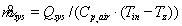

If the system is not active, the mass flow rate is set to zero and the system output is left at zero.

1.  The results for each zone are stored in the zone sizing data arrays.

### Updating and Adjusting the Zone Results

The results from *SizeZoneEquipment* are at the system time-step and are for all design days. These results then need to be summed or averaged over the zone time-step, peak values calculated for each design day, a heating & a cooling load sequence chosen for each zone from all the design day results, possible further smoothing of results done, zone coil loads calculated, and user sizing multipliers or user specified design flows taken into account. These tasks are accomplished by the subroutine *UpdateZoneSizing*. It is called at the start of each design day (*CallIndicator = BeginDay*), at the zone time-step (*CallIndicator = DuringDay*), at the end of the design day (*CallIndicator = EndDay*) and at the end of the zone design calculation (*CallIndicator = EndZoneSizingCalc*).

#### BeginDay

The environment (in this case, a design day) name and number are stored in the zone sizing data structures

#### DuringDay

The calculated and stored sequences are summed or averaged over the zone time-step.

#### EndDay

1.  Smooth the design sequences by applying a moving, fixed-width averaging window to the sequences. The width of the window is user specified in the *Sizing:Parameters* input object. The sequences that are smoothed are:
    1.  *CoolFlowSeq*
    2.  *CoolLoadSeq*
    3.  *HeatFlowSeq*
    4.  *HeatLoadSeq*
    5.  *CoolZoneRetTempSeq*
    6.  *HeatZoneRetTempSeq*

2.  The peak heating and cooling loads and mass & volume flow rates are extracted from each set of design sequences.
3.  Using the time of the peak and the design outside air fraction the design zone heating and cooling coil inlet temperatures and humidity ratios are calculated.
4.  For each zone, looking at the results for all of the design days, the design days that cause the peak heating and peak cooling for that zone are chosen and the corresponding design sequences and peak loads and flow rates are saved in the CalcFinalZoneSizing array. This finishes the calculated – unmodified by the user – portion of the zone design calculation.

#### EndZoneSizingCalc

1.  Write out onto a comma-separated file the calculated design sequences for each zone: *HeatLoadSeq*, *CoolLoadSeq*, *HeatFlowSeq*, *CoolFlowSeq* and the corresponding peaks and volumetric flow peaks.
2.  The data in *CalcZoneSizing* and *CalcFinalZoneSizing* is moved to *ZoneSizing* and *FinalZoneSizing*. The user modifications to the calculated sizing will be applied to and stored in *ZoneSizing* and *FinalZoneSizing*.
3.  The user can modify the calculated zone design results by specifying heating and cooling sizing factors at the global or zone level or by specifying and actual design heating or cooling zone design volumetric flow rate. All of this input is treated as a sizing factor. If the user inputs a cooling design volumetric flow rate for a zone it is divided by the calculated cooling design volumetric flow rate for the zone to give a zone cooling sizing factor. Note that the user can input a zone sizing factor or a zone design flow rate – not both – so there is never a conflict.
4.  Once the zone heating and cooling sizing factors are established, the design flow and load sequences as well as peak loads and flows are multiplied by the appropriate sizing factor and stored in *ZoneSizing* and *FinalZoneSizing*. This is the data that will be used for sizing zone HVAC equipment and in the system sizing calculation.
5.  The outside air fractions are recalculated using the new user-modified design flow rates and new design zone coil inlet conditions calculated and stored. At this point the condition that the design flow rates are never allowed to be less than the minimum outside air flow rate is imposed.

If *outside air method* is *flow/zone*, the input *outside air flow per zone* ** value will be used, even if it is zero or blank. If *outside air method* is *sum*, the sum of the *outside air flow per person* \* *DesignNumberOfPeople* + *outside air flow per area* \* *ZoneArea* will be used. If *outside air method* is *maximum*, the maximum of the *outside air flow per person* \* *DesignNumberOfPeople* and *outside air flow per area* \* *ZoneArea* will be used. If *outside air method* is *flow/person*, *outside air flow per person* will be used to calculate the design minimum outside airflow rate.

If *cooling design air flow method* is *flow/zone*, then *cooling design air flow rate* will be used for the design max cooling air flow rate.  If *cooling design air flow method* is *design day*, then the design day calculation will set the design max cooling air flow rate. If *cooling design air flow method* is *design day with limit*, then the maximum from *cooling min flow per area* and *cooling min flow* will set a lower limit on the design max cooling air flow rate. In all cases, the maximum from *cooling min flow per area*, *cooling min flow*, and *cooling min flow fraction* will set a minimum zone cooling air flow rate. In all cases the maximum design cooling air flow rate must be \>= to the ventilation requirement.

If *heating design air flow method* is *flow/zone*, then *heating design air flow rate* will be used for the design max heating air flow rate.  If *heating design air flow method* is *design day*, then the design day calculation will set the design max heating air flow rate. If *heating design air flow method* is *design day with limit*, then the maximum from *heating max flow per area*, *heating max flow* and *heating max flow fraction* will set an upper limit on the design max heating air flow rate. The design max heating air flow rate must always be \>= the ventilation requirement. In each case, the outside airflow will be modified based on zone ventilation effectiveness specified in the zone sizing object.

**This concludes the calculation of the zone design flow rates and loads.**

System Design Loads and Air Flow Rates
--------------------------------------

### Overview

The purpose of the system design calculation is to estimate design heating and cooling loads and air flow rates for each air loop in the simulation problem. The calculation sequence for system level design loads and air flow rates resembles the calculation sequence for zone loads and air flow rates. There is an update subroutine *UpdateSysSizing* called at the beginning, during, and end  of a loop in the Sizing Manager over all the design days. The major difference is that this calculation is done at the zone time-step only. There is no idealized component calculation triggered at the system time-step as in the zone calculation. The system design calculation operates at the zone time step using the design environment weather data and the data stored in the zone sizing arrays. The results of the system design calculation are stored in the system sizing arrays described below.

### System Design Data Arrays

The system design data arrays are:

*SysSizInput(i)* stores the input data from the Sizing:System objects.

*SysSizing(i,j)* stores the results of the system design calculations for all systems and all design days. The index i is for air loops, j for design days.

*CalcSysSizing(i*) stores the results of the system design calculations for the peak heating and cooling cases for each air loop. ** The index i is for the air loops.

*FinalSysSizing(i*) corresponds to *CalcSysSizing* but includes the effect of the user specified sizing factor or user specified system design flow rate.

The data stored in *SysSizing*, *CalcSysSizing* and *FinalSysSizing* includes the following data items.

 

Table 38.  System Sizing Data

<table>
<colgroup>
<col width="50%" />
<col width="50%" />
</colgroup>
<tbody>
<tr class="odd">
<td align="left">
Name

Description
</td>
<td align="left">
All the data from <em>SysSizInput</em>

 
</td>
</tr>
</tbody>
</table>

### System Design Flow Rate and Load Summation and Adjustment

There is no system level subroutine corresponding to *SizeZoneEquipment.* Instead the system design loads and flow rates are calculated using the zone level results. The zone design flow rates for the zones served by an air loop are summed to obtain the system level design flow rates. These air flows are mixed with the system level design minimum outside air flow rate to obtain system design coil loads. These activities are all performed within the *UpdateSysSizing* subroutine in the *SimAirServingZones* module. It is called at the start of each design day (*CallIndicator = BeginDay*), at the zone time-step (*CallIndicator = DuringDay*), at the end of the design day (*CallIndicator = EndDay*) and at the end of the zone design calculation (*CallIndicator = EndSysSizingCalc*).

There is a logical flag *SysSizingCalc* corresponding to *ZoneSizingCalc*.  It is used to allow the component routines to distinguish a normal simulation call from a being called during a system sizing calculation.

#### BeginDay

1.  The environment (in this case, a design day) name is stored in the system sizing data structures.
2.  Loop over the zones cooled by this air loop:
    1.  *NonCoinCoolMassFlowsys*=*****DesCoolMassFlowzone*

3.  Loop over the zones heated by this air loop:
    1.  *NonCoinHeatMassFlowsys*=*****DesHeatMassFlowzone*

#### DuringDay

1.  Loop over the zones cooled by this air loop:

*CoolFlowSeqsys(i)* =*****CoolFlowSeq* *zone*(i)

*SysCoolRetTemp(i)*= **** ****(*CoolZoneRetTempSeq(i)* *CoolFlowSeqzone(i)*)** *CoolFlowSeqsys(i)*

*SysCoolRetHumRat(i)*= **** ****(*CoolZoneHumRatSeq(i)* *CoolFlowSeqzone(i)*)** *CoolFlowSeqsys(i)*

*FracOA=air* *DesOutAirVolFlowsys*/ *CoolFlowSeqsys(i)*

*Tmix*=*Toutside* *FracOA* + *SysCoolRetTemp(i)*(1 – *FracOA*)

*Wmix*=*Woutside* *FracOA* + *SysCoolRetHumRat (i)*(1 – *FracOA*)

*SysCoolOutTempSeq(i)*= *Toutside*

*SysCoolOutHumRatSeq(i)*= *Woutside*

Get the current (zone time-step) system cooling capacity:

*SysSensCoolCapcur*=*Cp,air* *CoolFlowSeqsys(i)* ( *Tmix*-*Tsup*)

*SensCoolCapSeq(I)*= *SysSensCoolCapcur*

If *SysSensCoolCapcur* is the maximum for the day so far then save *SysSensCoolCapcur* as the design value:

*SensCoolCap(i* ** *)sys*= *SysSensCoolCapcur*

And save the corresponding mixed, return and outside conditions:

*CoolMixTempsys*= *Tmix*

*CoolMixHumRatsys*=*Wmix*

*CoolRetTempsys*= *SysCoolRetTemp(i)*

*CoolRetHumRatsys*= *SysCoolRetHumRat(I)*

*CoolOutTempsys*= *Toutside*

*CoolOutHumRatsys*= *Woutside*

Here*air* is the density of dry air at 20C and standard elevation corrected pressure, [kg/m3];

*FracOA* is the outside air fraction;

*Cp,air* is the specific heat of dry air at 20C, [J/kg-K];

*Tsup* is the user specified design cooling supply temperature [C];

*Tmix* is the current mixed air temperature [C];

*Wmix* is the current mixed air humidity ratio [kg water / kg dry air];

*Toutside* is the current outside air temperature [C];

*Woutside* is the current outside air humidity ratio [kg water / kg dry air].

1.  Loop over the zones heated by this air loop.

*HeatFlowSeqsys(i)* =*****HeatFlowSeq* *zone*(i)

*SysHeatRetTemp(i)*= **** ****(*HeatZoneRetTempSeq(i)* *HeatFlowSeqzone(i)*)**

*HeatFlowSeqsys(i)*

*SysHeatRetHumRat(i)*= **** ****(*HeatZoneHumRatSeq(i)* *HeatFlowSeqzone(i)*)**

*HeatFlowSeqsys(i)*

*FracOA=air* *DesOutAirVolFlowsys*/ *HeatFlowSeqsys(i)*

*Tmix*=*Toutside* *FracOA* + *SysHeatRetTemp(i)*(1 – *FracOA*)

*Wmix*=*Woutside* *FracOA* + *SysHeatRetHumRat (i)*(1 – *FracOA*)

*SysHeatOutTempSeq(i)*= *Toutside*

*SysHeatOutHumRatSeq(i)*= *Woutside*

Get the current (zone time-step) system heating capacity:

*SysHeatCapcur*=*Cp,air* *MinFlowRatsys**HeatFlowSeqsys(i)* ( *Tsup*-*Tmix*)

*HeatCapSeq(I)*= *SysHeatCapcur*

If *SysHeatCapcur* is the maximum for the day so far then save *SysHeatCapcur* as the design value:

*HeatCap(i* ** *)sys*= *SysHeatCapcur*

And save the corresponding mixed, return and outside conditions:

*HeatMixTempsys*= *Tmix*

*HeatMixHumRatsys*=*Wmix*

*HeatRetTempsys*= *SysHeatRetTemp(i)*

*HeatRetHumRatsys*= *SysHeatRetHumRat(I)*

*HeatOutTempsys*= *Toutside*

*HeatOutHumRatsys*= *Woutside*

Here *MinFlowRatsys* is the user specified minimum supply flow ratio.

#### EndDay

If the user has specified *coincident* system sizing then:

*DesCoolVolFlowsys*=*air**CoinCoolMassFlowsys*

*DesHeatVolFlowsys*=*air**CoinHeatMassFlowsys*

*DesMainVolFlowsys*=**Max**(*DesCoolVolFlowsys*, *DesHeatVolFlowsys*)

If the user has specified *noncoincident*system sizing then:

*DesCoolVolFlowsys*=*air**NonCoinCoolMassFlowsys*

*DesHeatVolFlowsys*=*air**NonCoinHeatMassFlowsys*

*DesMainVolFlowsys*=**Max**(*DesCoolVolFlowsys*, *DesHeatVolFlowsys*)

Based on the outdoor air method selected, the *DesCoolVolFlowsys* and *DesHeatVolFlowsys* are modified based on the system ventilation effciency calculated based on the maximum outdoor air fraction.

#### EndSysSizingCalc

At this point all the calculations have been done in *SysSizing(i,j)*: we have results for each design day. Now these results need to be processed to find the heating and cooling design quantities for each system over all the design days.

For coincident sizing the task is quite easy.

1.  Loop over all of the air loops.
    1.  Loop over all of the design days.
        1.  If the value of *DesCoolVolFlow* in *SysSizing* for the current design day is greater than the value stored in *CalcSysSizing*, then move *DesCoolVolFlow* from *SysSizing* into *CalcSysSizing* along with *CoolDesDay*, *CoinCoolMassFlow*, *SensCoolCap*, *CoolFlowSeq(i)*, *SensCoolCapSeq(i),* *CoolMixTemp*, *CoolRetTemp*, *CoolMixHumRat*, *CoolRetHumRat*, *CoolOutTemp*, *CoolOutHumRat*, *SysCoolRetTempSeq(i)*, *SysCoolRetHumRatSeq(i)*, *SysCoolOutTempSeq(i)* and *SysCoolOutHumRatSeq(i)*.
        2.  If the value of *DesHeatVolFlow* in *SysSizing* for the current design day is greater than the value stored in *CalcSysSizing*, then move *DesHeatVolFlow* from *SysSizing* into *CalcSysSizing* along with *HeatDesDay*, *CoinHeatMassFlow*, *HeatCap*, *PreHeatCap*, *HeatFlowSeq(i)*, *HeatCapSeq(i),* *PreHeatCapSeq(i), HeatMixTemp*, *HeatRetTemp*, *HeatMixHumRat*, *HeatRetHumRat*, *HeatOutTemp*, *HeatOutHumRat*, *SysHeatRetTempSeq(i)*, *SysHeatRetHumRatSeq(i)*, *SysHeatOutTempSeq(i)* and *SysHeatOutHumRatSeq(i)*.

At the end of each design day loop the peak cooling and the peak heating data will be stored in *CalcSysSizing*. At this point we set *DesMainVolFlow* in *CalcSysSizing* equal to the maximum of *DesCoolVolFlow* and *DesHeatVolFlow.*

For noncoincident sizing the task is harder since we don’t have a single time-step during which all the zone peaks occur. So there is no obvious value for outside air temperature at the peak, return air temperature at the peak and so forth. We must return to the zone sizing data and calculate average values for return and outside conditions.

1.  Loop over all of the zones cooled by this air loop
    1.  In *FinalZoneSizing* replace the value in *DesCoolCoilInTemp* with the user specified *CoolSupTempsys*. Do the same for *DesCoolCoilInHumRat* and *CoolSupHumRat*. This ensures that zone equipment connected to an air loop will use the system design supply air conditions as coil entering conditions.
    2.  *NonCoinCoolMassFlowsys*=*****DesCoolMassFlowzone*

*SysCoolRetTemp*=****(*ZoneRetTempAtCoolPeakDesCoolMassFlowzone*)

/ ** *NonCoinCoolMassFlowsys*

*SysCoolRetHumRat*=****(*ZoneHumRatAtCoolPeak*

*DesCoolMassFlowzone*)/ ** *NonCoinCoolMassFlowsys*

*SysCoolOutTemp*=****(*TOA,zone peakDesCoolMassFlowzone*)/

** *NonCoinCoolMassFlowsys*

*SysCoolOutHumRat*=****(*WOA,zone peakDesCoolMassFlowzone*)/

** *NonCoinCoolMassFlowsys*

At the end of the zone loop calculate mixed air conditions and the system sensible cooling capacity.

*FracOA=air* *DesOutAirVolFlowsys*/ *NonCoinCoolMassFlowsys*

*Tmix* =*SysCoolOutTemp* *FracOA* + *SysCoolRetTemp* (1 – *FracOA*)

*Wmix* = *SysCoolOutHumRat*  *FracOA* + *SysCoolRetHumRat* 

(1 – *FracOA*)

*SysSensCoolCap*=*Cp,air* *NonCoinCoolMassFlow* ( *Tmix*-*Tsup*)

Then (for noncoincident sizing) the variables calculated in section (ii) are moved into the *CalcSysSizing* Array.

1.  Loop over all of the zones heated by this air loop.
    1.  In *FinalZoneSizing* replace the value in *DesHeatCoilInTemp* with the user specified *HeatSupTempsys*. Do the same for *DesHeatCoilInHumRat* and *HeatSupHumRat*. This ensures that zone equipment connected to an air loop will use the system design supply air conditions as coil entering conditions.
    2.  *NonCoinHeatMassFlowsys*=*****DesHeatMassFlowzone*

*SysHeatRetTemp*=****(*ZoneRetTempAtHeatPeakDesHeatMassFlowzone*)

/ ** *NonCoinHeatMassFlowsys*

*SysHeatRetHumRat*=****(*ZoneHumRatAtHeatPeak*

*DesHeatMassFlowzone*)/ ** *NonCoinHeatMassFlowsys*

*SysHeatOutTemp*=****(*TOA,zone peakDesHeatMassFlowzone*)/

** *NonCoinHeatMassFlowsys*

*SysHeatOutHumRat*=****(*WOA,zone peakDesHeatMassFlowzone*)/

** *NonCoinHeatMassFlowsys*

At the end of the zone loop calculate mixed air conditions and the system sensible cooling capacity.

*FracOA=air* *DesOutAirVolFlowsys*/ *NonCoinHeatMassFlowsys*

*Tmix* =*SysHeatOutTemp* *FracOA* + *SysHeatRetTemp* (1 – *FracOA*)

*Wmix* = *SysHeatOutHumRat*  *FracOA* + *SysHeatRetHumRat* 

(1 – *FracOA*)

*SysHeatlCap*=*Cp,air* *NonCoinHeatlMassFlow* ( *Tsup*-*Tmix*)

Then (for noncoincident sizing) the variables calculated in section (ii) are moved into the *CalcSysSizing* Array.

1.  We now have the calculated system sizing data. This data needs to be altered to take into account the user input system design flow rates (if any), or the fact that the user may have requested that the system flow rate be sized on the ventilation requirement. Note that user specified sizing ratios have already been applied to the zone sizing data which have been used in out preceding system sizing calculation. Thus the user specified sizing ratios do not have to be explicitly taken into account at the system level.

First we move the calculated system sizing data from *CalcSysSizing* array into the *FinalSysSizing* array. *FinalSysSizing* will contain the user modified system design data when we are all done.

Loop over the air loops.

1.  As in the zone case, the user specified system design flow rates are turned into sizing ratios by dividing the user input value by the calculated value. The same strategy is employed for sizing on the ventilation requirement: the design ventilation flow rate is divided by the calculated design flow rate value. For each air loop this gives us a *SizRatcool* and *SizRatheat*.

*CoinCoolMassFlow*= *SizRatcool* *CoinCoolMassFlowcalc*

*NonCoinCoolMassFlow*= *SizRatcool* *NonCoinCoolMassFlowcalc*

*DesCoolVolFlow*= *SizRatcool* *DesCoolVolFlowcalc*

Since the flow rates have been altered the outside air fraction will change. This will alter the design mixed air conditions and lead to an altered value for the cooling capacity. This must be done for the time-step sequence and for the peak value.

1.  Loop over the zone timesteps (index=*i*).

*CoolFlowSeqsys(i)*= *SizRatcool* *CoolFlowSeqsys,calc(i)*

*FracOA=air* *DesOutAirVolFlowsys*/ *CoolFlowSeqsys(i)*

*Tmix*= *SysCoolOutTempSeq(i)FracOA +*

*SysCoolRetTempSeq(i)(*1-FracOA)

*SensCoolCapSeq(i)*= *Cp,air* *CoolFlowSeqsys(i)* ( *Tmix*-*Tsup*)

1.  Do the same calculation for peak cooling.

*FracOA=air* *DesOutAirVolFlowsys*/ *DesCoolVolFlow*

*Tmix*= *CoolOutTempsysFracOA + CoolRetTempsys(*1-FracOA)

*Wmix*= *CoolOutHumRatsysFracOA + CoolRetHumRatsys*

*(*1-FracOA)

*SensCoolCapsys*= *Cp,air* *DesCoolVolFlowsys* ( *Tmix*-*Tsup*)

*Tmix* and *Wmix* are saved in *FinalSysSizing* *.*

1.  Do the same calculation for the heating case.

*CoinHeatMassFlow*= *SizRatheat* *CoinHeatMassFlowcalc*

*NonCoinHeatMassFlow*= *SizRatheat* *NonCoinHeatMassFlowcalc*

*DesHeatVolFlow*= *SizRatheat* *DesHeatVolFlowcalc*

1.  Loop over the zone timesteps (index=*i*).

*HeatFlowSeqsys(i)*= *SizRatHeat*  *HeatFlowSeqsys,calc(i)*

*FracOA=air* *DesOutAirVolFlowsys*/ *HeatFlowSeqsys(i)*

*Tmix*= *SysHeatOutTempSeq(i)* *FracOA +*

*SysHeatRetTempSeq(i)* ** *(*1-FracOA)

*HeatCapSeq(i)*= *Cp,air* *HeatFlowSeqsys(i)* (*Tsup*-*Tmix*)

1.  Do the same calculation for peak heating.

*FracOA=air* *DesOutAirVolFlowsys*/ *DesHeatVolFlow*

*Tmix*= *HeatOutTempsysFracOA + HeatRetTempsys* ** *(*1-FracOA)

*Wmix*= *HeatOutHumRatsysFracOA + HeatRetHumRatsys* **

*(*1-FracOA)

*HeatCapsys*= *Cp,air* *DesHeatVolFlowsys* ( *Tsup*-*Tmix*)

*Tmix* and *Wmix* are saved in *FinalSysSizing* *.*

1.  *DesMainVolFlowsys*=**MAX**(*DesCoolVolFlowsys*,*DesHeatVolFlowsys*)

**This concludes the system design calculation.**

Plant Loop Sizing
-----------------

### Introduction

The program needs to be able to autosize the fluid flow rate in each plant fluid loop. The design plant loop flow rates are set by the sum of the needs of the demanding components on each loop. For chilled water loops these components will be cooling coils. For hot water loops – hot water coils. And for condenser loops – various types of chiller that use condenser water for cooling. Each component that uses water for heating or cooling stores its design water flow rate (in its sizing routine) in the array *CompDesWaterFlow*, labeled by its inlet water supply node number. These individual component design water flow rates are then accessed, summed for each plant loop, and stored in the *PlantSizingData* array. This array also contains the user specified design values for each plant loop.

### Hot and Chilled Water Loop Sizing

#### Maximum Loop Volumetric Flow Rate

The loop maximum volumetric flow rate (m3) is just set equal to the value stored in the *PlantSizData* array for this loop.

#### Volume of the plant loop

Since the loop capacitance has a stability requirement of 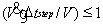 the volume is set so that the stability requirement will be 0.8 at the zone time step, which is the largest time step encountered at the max flow rate the loop can reach.

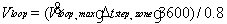

### Condenser Loop Sizing

#### Maximum Loop Volumetric Flow Rate

The loop maximum volumetric flow rate (m3) is just set equal to the value stored in the *PlantSizData* array for this loop.

#### Volume of the plant loop

Since the loop capacitance has a stability requirement of  the volume is set so that the stability requirement will be 0.8 at the zone time step, which is the largest time step encountered at the max flow rate the loop can reach.

Component Sizing
----------------

### Introduction

In EnergyPlus each HVAC component sizes itself. Each component module contains a sizing subroutine. When a component is called for the first time in a simulation, it reads in its user specified input data and then calls the sizing subroutine. This routine checks the autosizable input fields for missing data and calculates the data when needed.

A number of high-level variables are used in the sizing subroutines.

*CurDuctType* (in *DataSizing*) contains the information about the current duct type. The types can be *main*, *cooling*, *heating* or *other*.

*CurZoneEqNum* (in *DataSizing*) is the current zone equipment set index and indicates that the component is a piece of zone equipment and should size itself using the zone sizing data arrays.

*CurSysNum* (in *DataSizing*) is the current air loop index and indicates that the component is part of the primary air system and should size itself using the system sizing data arrays.

### Fan Sizing

Fan sizing is done in subroutine *SizeFan*.

#### Max Flow Rate

If the fan is part of the central air system then check the duct type.

For duct type = *main, other* or default

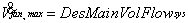

For duct type=*cooling*

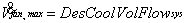

For duct type=*heating*

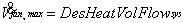

If the fan is zone equipment then check whether it is part of a component that only does heating.

For heating only 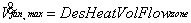;

Otherwise 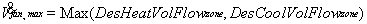

If the max fan flow rate is less than *SmallAirVolFlow* the max flow rate is set to zero.

### Coil:Cooling:Water

The sizing is done in subroutine *SizeWaterCoil* of module *WaterCoils*

#### Design Water Flow Rate (m3/s)

##### System Coils

The design water volumetric flow rate is calculated using:

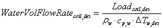

*Tw,des* is just the *Loop Design Temperature Difference* user input from *Sizing:Plant* (if the coil is in the outside air stream, ½ the *Loop Design Temperature Difference* is used). The design coil load *Loadcoil,des* is calculated from:

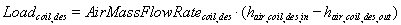

The design air mass flow rate depends on the location of the coil. If the coil is in the outside air stream the flow rate is set to *air**DesOutAirVolFlowsys* (the design outside air volumetric flow for the system). If the coil is in a cooling duct the flow rate is set to *air**DesCoolVolFlowsys*. If the coil is in a heating duct the flow rate is set to *air**DesHeatVolFlowsys*. If the coil is in the main duct (or any other kind of duct) the flow rate is set to *air**DesMainVolFlowsys*.

To obtain the inlet and outlet enthalpies, we need the inlet and outlet temperatures and humidity ratios. The inlet and outlet conditions depend on whether the coil is in the outside air stream and if it is not, whether or not there is outside air preconditioning.

1.  Coil in outside air stream
    1.  *Tair,in,des* = *CoolOutTempsys* (the outside air temperature at the design cooling peak)
    2.  *Tair,out,des* = *PrecoolTempsys*  (the specified Precool Design Temperature from the *Sizing:System* object).
    3.  *Wair,in,des* = *CoolOutHumRatsys* (the outside humidity ratio at the design cooling peak)
    4.  *Wair,out,des* = *PrecoolHumRatsys* (the specified Precool Design Humidity Ratio from the *Sizing:System* object)

2.  Coil in main air stream, no preconditioning of outside air
    1.  *Tair,in,des* = *CoolMixTempsys* (the mixed air temperature at the design cooling peak)
    2.  *Wair,in,des* = *CoolMixHumRatsys* (the mixed air humidity ratio at the design cooling peak)
    3.  *Tair,out,des* = *CoolSupTempsys*  (the specified Central Cooling Design Supply Air Temperature from the *Sizing:System* object)
    4.  *Wair,out,des* = *CoolSupHumRatsys* (the specified Central Cooling Design Supply Air Humidity Ratio from the *Sizing:System* object)

3.  Coil in main air stream, outside air preconditioned. The outside air fraction is calculated as *Frac*oa ** = *DesOutAirVolFlowsys* / *DesVolFlow*. *DesVolFlow* is just *AirMassFlowRatecoil,des* / *air*.
    1.  *Tair,in,des*=*Frac*oa*PrecoolTempsys* + (1. *Fracoa*)*CoolRetTempsys* (see [Table 38.  System Sizing Data](#_Ref226429752))
    2.  *Wair,in,des*=*FracoaPrecoolHumRatsys* + (1. *Fracoa*)*CoolRetHumRatsys*
    3.  *Tair,out,des* = *CoolSupTempsys* (the specified Central Cooling Design Supply Air Temperature from the *Sizing:System* object)
    4.  *Wair,out,des* = *CoolSupHumRatsys* (the specified Central Cooling Design Supply Air Humidity Ratio from the *Sizing:System* object)

With the inlet and outlet conditions established, we can obtain the inlet and outlet enthalpies:

*hair,coil,des,in* = *PsyHFnTdbW*(*Tair,in,des*, *Wair,in,des*)

*hair,coil,des,out* = *PsyHFnTdbW*(*Tair,out,des*, *Wair,out,des*)

where *PsyHFnTdbW* ** is the EnergyPlus function for calculating air specific enthalpy given the air temperature and humidity ratio. We now have all we need to calculate *Loadcoil,des* and *WaterVolFlowRatecoil,des*.

##### Zone Coils

If the coil is part of an *AirTerminal:SingleDuct:ConstantVolume:FourPipeInduction* unit, the water flow rate is set equal to the terminal unit’s chilled water flow rate. Otherwise (e.g., the zone-level coil is part of *ZoneHVAC:FourPipeFanCoil, ZoneHVAC:UnitVentilator or ZoneHVAC:VentilatedSlab*) the calculation is similar to that at the system level. A design load is calculated:

Where:

AirMassFlowRatecoil,des = DesCoolMassFlowzone (see [Table 37.  Zone Sizing Data](#_Ref226429779))

hair,coil,des,in = PsyHFnTdbW(Tair,in,des, Wair,in,des)

hair,coil,des,out = PsyHFnTdbW(Tair,out,des, Wair,out,des)

Tair,in,des = DesCoolCoilInTempzone (see [Table 37](#_Ref226429800))

Wair,in,des = DesCoolCoilInHumRatzone (see [Table 37](#_Ref226429800))

Tair,out,des = CoolDesTempzone (user input from Zone:Sizing object)

Wair,out,des = CoolDesHumRatzone (user input from Zone:Sizing object)

where *Tw,des* is the *Loop Design Temperature Difference* user input from the *Sizing:Plant* object*.*

#### Design Air Flow Rate

##### System Coils

The design air volumetric flow rate depends on the location of the coil. If the coil is in the outside air stream the flow rate is set to *DesOutAirVolFlowsys*. If the coil is in a cooling duct the flow rate is set to *DesCoolVolFlowsys*. If the coil is in a heating duct the flow rate is set to *DesHeatVolFlowsys*. If the coil is in the main duct (or any other kind of duct) the flow rate is set to *DesMainVolFlowsys*.

##### Zone Coils

If the coil is part of an *AirTerminal:SingleDuct:ConstantVolume:FourPipeInduction* unit, the design air volumetric flow rate is set equal to the flow rate of the terminal unit. For all other zone coils it is set equal to:

Max(DesCoolMassFlowzone,DesHeatMassFlowzone)  air

#### Design Inlet Air Temperature

##### System Coils

The inlet air temperature depends on whether the coil is in the outside air stream and if it is not, whether or not there is outside air preconditioning.

1.  Coil in outside air stream: *Tair,in* = *CoolOutTempsys* (the outside air temperature at the design cooling peak).
2.  Coil in main air stream, no preconditioning of outside air: *Tair,in* = *CoolMixTempsys* (the mixed air temperature at the design cooling peak).
3.  Coil in main air stream, outside air preconditioned. The outside air fraction is calculated as *Frac*oa ** = *DesOutAirVolFlowsys* / *DesVolFlow*. *DesVolFlow* is just *AirMassFlowRatecoil,des* / *air*. Then

*Tair,in*=*Frac*oa*PrecoolTempsys* + (1. *Fracoa*)*CoolRetTempsys*

##### Zone Coils

If the coil is part of an *AirTerminal:SingleDuct:ConstantVolume:FourPipeInduction* unit, the Design Inlet Air Temperature is set equal to *ZoneTempAtCoolPeakzone* (see [Table 37.  Zone Sizing Data](#_Ref226429841)). For all other zone coils, it is set equal to *DesCoolCoilInTempzone* (see [Table 37](#_Ref226429800)).

#### Design Outlet Air Temperature

##### System Coils

The outlet air temperature depends on whether the coil is in the outside air stream.

1.  Coil in outside air stream: *Tair,out,des* = *PrecoolTempsys*  (the specified Precool Design Temperature from the *Sizing:System* object).
2.  Coil in main air stream: *Tair,out,des* = *CoolSupTempsys*  (the specified Central Cooling Design Supply Air Temperature from the *Sizing:System* object)

##### Zone Coils

If the coil is part of an *AirTerminal:SingleDuct:ConstantVolume:FourPipeInduction* unit, then:

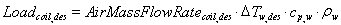

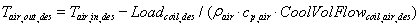

where *CoolVolFlowcoil,air,des* is the user input or previously autosized coil Design Air Flow Rate. For all other zone coils the Design Outlet Air Temperature is set to *CoolDesTempzone* (see [Table 37.  Zone Sizing Data](#_Ref226429884)).

#### Design Inlet Air Humidity Ratio

##### System Coils

The inlet air humidity ratio depends on whether the coil is in the outside air stream and if it is not, whether or not there is outside air preconditioning.

1.  Coil in outside air stream: *Wair,in,des* = *CoolOutHumRatsys* (the outside humidity ratio at the design cooling peak).
2.  Coil in main air stream, no preconditioning of outside air: *Wair,in,des* = *CoolMixHumRatsys* (the mixed air humidity ratio at the design cooling peak).
3.  Coil in main air stream, outside air preconditioned. The outside air fraction is calculated as *Frac*oa ** = *DesOutAirVolFlowsys* / *DesVolFlow*. *DesVolFlow* is just *AirMassFlowRatecoil,des* / *air*. Then

*Wair,in,des*=*FracoaPrecoolHumRatsys* + (1. *Fracoa*)*CoolRetHumRatsys*

##### Zone Coils

If the coil is part of an *AirTerminal:SingleDuct:ConstantVolume:FourPipeInduction* unit, the Design Inlet Air Humidity Ratio is set equal to *ZoneHumRatAtCoolPeakzone* (see [Table 37.  Zone Sizing Data](#_Ref226429922)). For all other zone coils, it is set equal to *DesCoolCoilInHumRatzone* (see [Table 37](#_Ref226429800)).

#### Design Outlet Air Humidity Ratio

##### System Coils

The outlet air humidity ratio depends on whether the coil is in the outside air stream.

1.  Coil in outside air stream: *Wair,out,des* = *PrecoolHumRatsys* (the specified Precool Design Humidity Ratio from the *Sizing:System* object)
2.  Coil in main air stream: *Wair,out,des* = *CoolSupHumRatsys* (the specified Central Cooling Design Supply Air Humidity Ratio from the *Sizing:System* object)

##### Zone Coils

The Design Outlet Air Humidity Ratio is set equal to *CoolDesHumRatzone* (user input from *Zone:Sizing*).

#### Design Inlet Water Temperature

##### System Coils

The Design Inlet Water Temperature is set to the *Design Loop Exit Temperature* specified in the *Sizing*:*Plant* object for the water loop serving this coil.

##### Zone Coils

The Design Inlet Water Temperature is set to the *Design Loop Exit Temperature* specified in the *Sizing*:*Plant* object for the water loop serving this coil.

### Coil:Cooling:Water:DetailedGeometry Sizing

The sizing is done in subroutine *SizeWaterCoil*

#### Max Water Flow Rate of Coil

The calculation is identical to that done for *Coil:Cooling:Water*.

#### Number of Tubes per Row

*Ntube/row*=**Max**(*Ntube/row*,3)

#### Fin Diameter

Depending on the duct type, get the coil design air flow rate.

For duct type = *main, other* or default

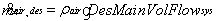

for duct type=*cooling*

for duct type=*heating*

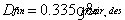

#### Minimum Air Flow Area

Depending on the duct type, get the coil design air flow rate.

For duct type = *main, other* or default

for duct type=*cooling*

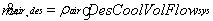

for duct type=*heating*

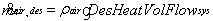

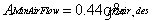

#### Fin Surface Area

Depending on the duct type, get the coil design air flow rate.

For duct type = *main, other* or default

for duct type=*cooling*

for duct type=*heating*

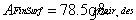

#### Total Tube Inside Area

*Atube,total inside*=4.4*Dtube,inside**Ntube rows**Ntubes/row*

Where *Dtube,inside* is the tube inside diameter.

#### Tube Outside Surf Area

*Atube,outside*=4.1*Dtube,outside**Ntube rows**Ntubes/row*

Where *Dtube,outside* is the tube outside diameter.

#### Coil Depth

*Depthcoil*=*Depthtube spacing* *Ntube rows*

### Coil:Cooling:WaterToAirHeatPump:EquationFit Sizing

The sizing is done in subroutine *SizeHVACWaterToAir*

#### Rated Air Flow Rate

The calculation is identical to that done for *Coil:Cooling:Water*.

#### Rated Water Flow Rate

The calculation is identical to that done for *Coil:Cooling:Water*, which is the coil design load divided by the *Loop Design Temperature Difference* user input from *Sizing:Plant.* If there is a companion heating coil, the heating coil design load is used so that both modes will have the same rated water flow rate. For sizing the plant loop serving this coil, only one half of this flow rate is used since both the cooling and heating coil will save a flow rate but only one of these coils will operate at a time.

#### Rated Total Cooling Capacity

The calculation for coil operating temperatures (inlet and outlet) are identical to that done for *Coil:Cooling:Water*. The following calculations are then performed to determine the rated total cooling capacity.

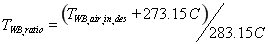

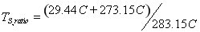

where:

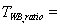ratio of load-side inlet air wet-bulb temperature in Kelvin to a reference temperature

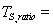 ratio of source-side inlet water temperature in Kelvin to a reference temperature

TCC1 = user input for Total Cooling Capacity Coefficient 1

TCC2 = user input for Total Cooling Capacity Coefficient 2

TCC3 = user input for Total Cooling Capacity Coefficient 3

TCC4 = user input for Total Cooling Capacity Coefficient 4

TCC5 = user input for Total Cooling Capacity Coefficient 5

The 4th and 5th coefficient (TCC4 and TCC5) used in the above equation are multipliers for the load-side and source-side flow ratios, respectively. For sizing, these ratios are assumed to be 1.

The enthalpy of the entering air is then compared with the enthalpy of the exiting air. The calculations for air enthalpy are identical to that done for *Coil:Cooling:Water*. If the entering air enthalpy is less than the exiting air enthalpy, a reference value of 48,000 J/kg is used as the entering air enthalpy. If the TotCapTempModFac calculation above yields 0 as the result, a value of 1 is used in the following calculation. If the design air mass flow rate is determined to be less than a very small flow value (0.001 kg/s) or the capacity calculated here is less than 0, the coil total cooling capacity is set equal to 0.

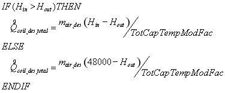

#### Rated Sensible Cooling Capacity

The calculation for coil operating temperatures (inlet and outlet) are identical to that done for *Coil:Cooling:Water*. The following calculations are then performed to determine the rated sensible cooling capacity.

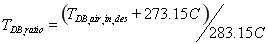

where:

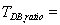ratio of load-side inlet air dry-bulb temperature in Kelvin to a reference temperature

SCC1 = user input for Sensible Cooling Capacity Coefficient 1

SCC2 = user input for Sensible Cooling Capacity Coefficient 2

SCC3 = user input for Sensible Cooling Capacity Coefficient 3

SCC4 = user input for Sensible Cooling Capacity Coefficient 4

SCC5 = user input for Sensible Cooling Capacity Coefficient 5

SCC6 = user input for Sensible Cooling Capacity Coefficient 6

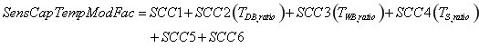

The 5th and 6th coefficient (SCC5 and SCC6) used in the above equation are multipliers for the load-side and source-side flow ratios, respectively. For sizing, these ratios are assumed to be 1.

The dry-bulb temperature of the entering air is then compared with the dry-bulb temperature of the exiting air. The calculations for air dry-bulb temperature are identical to that done for *Coil:Cooling:Water*. If the entering air dry-bulb temperature is less than the exiting air dry-bulb temperature, a reference value of 24 C is used as the entering air dry-bulb temperature. If the SensCapTempModFac calculation above yields 0 as the result, a value of 1 is used in the following calculation. If the design air mass flow rate is determined to be less than a very small flow value (0.001 kg/s) or the capacity calculated here is less than 0, the coil sensible cooling capacity is set equal to 0.

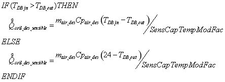

### Coil:Cooling:WaterToAirHeatPump:VariableSpeedEquationFit Sizing

For the cooling coil of VS WSHP, we specify a nominal speed level. During the sizing calculation, the Rated Air Volume Flow Rate, the Rated Water Volume Flow Rate and the Rated Total Cooling Capacity at the Selected Nominal Speed Level are determined in the same way as the *Coil:Cooling:WaterToAirHeatPump:EquationFit* object. The sensible heat transfer rate is not allowed for auto-sizing, instead, it is a function of the rated air and water flow rates, rated total cooling capacity and the Reference Unit SHR at the nominal speed level. The default nominal speed level is the highest speed. However, the model allows the user to select a nominal speed level rather than the highest.

#### Rated Air Flow Rate

The calculation is identical to that done for *Coil:Cooling:WaterToAirHeatPump:EquationFit*.

#### Rated Water Flow Rate

The calculation is identical to that done for *Coil:Cooling:WaterToAirHeatPump:EquationFit* , which is the coil design load divided by the *Loop Design Temperature Difference* user input from *Sizing:Plant.* If there is a companion heating coil, the heating coil design load is used so that both modes will have the same rated water flow rate. For sizing the plant loop serving this coil, only one half of this flow rate is used since both the cooling and heating coil will save a flow rate but only one of these coils will operate at a time.

#### Rated Total Cooling Capacity

The calculation for coil operating temperatures (inlet and outlet) are identical to that done for *Coil:Cooling:WaterToAirHeatPump:EquationFit*. The calculations for air enthalpy are similar to that done for *Coil:Cooling:WaterToAirHeatPump:EquationFit.* The difference is in calculating the total cooling capacity temperature modifier function at the selected nominal speed level, as below:

where

WBi = wet-bulb temperature of the air entering the heating coil, °C

EWT = entering water temperature, °C

a-f = regression curve-fit coefficients.

If the entering air enthalpy is less than the exiting air enthalpy, a reference value of 48,000 J/kg is used as the entering air enthalpy. If the *TotCapTempModFac* calculation above yields 0 as the result, a value of 1 is used in the following calculation. If the rated air mass flow rate is determined to be less than a very small flow value (0.001 kg/s) or the capacity calculated here is less than 0, the coil total cooling capacity is set equal to 0.

*If Hin* *\> Hout* *Then*

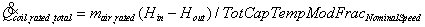

*Else*

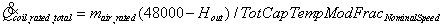

*End If*

### Coil:Heating:WaterToAirHeatPump:EquationFit Sizing

The sizing is done in subroutine *SizeHVACWaterToAir.*

#### Rated Air Flow Rate

The calculation is identical to that done for *Coil:Cooling:Water*.

#### Rated Water Flow Rate

The calculation is identical to that done for *Coil:Cooling:Water* , which is the coil design load divided by the *Loop Design Temperature Difference* user input from *Sizing:Plant.* For sizing the plant loop serving this coil, only one half of this flow rate is used since both the cooling and heating coil will save a flow rate but only one of these coils will operate at a time.

#### Rated Total Heating Capacity

The rated total heating capacity is set equal to the rated total cooling capacity.

### Coil:Heating:WaterToAirHeatPump:VariableSpeedEquationFit Sizing

For the heating coil of VS WSHP, we specify a nominal speed level. During the sizing calculation, the Rated Air Volume Flow Rate and the Rated Water Volume Flow Rate are determined in the same way as the *Coil:Heating:WaterToAirHeatPump:EquationFit* object. On the other hand, the Rated Heating Capacity at the Selected Nominal Speed Level should be the same as the total cooling capacity of its corresponding cooling coil, which has to be sized first. The default nominal speed level will be the highest speed. However, the model allows the user to select a nominal speed level rather than the highest.

#### Rated Air Flow Rate

The calculation is identical to that done for Coil:Cooling:WaterToAirHeatPump:EquationFit.

#### Rated Water Flow Rate

The calculation is identical to that done for Coil:Cooling:WaterToAirHeatPump:EquationFit, which is the coil design load divided by the *Loop Design Temperature Difference* user input from *Sizing:Plant.* For sizing the plant loop serving this coil, only one half of this flow rate is used since both the cooling and heating coil will save a flow rate but only one of these coils will operate at a time.

#### Rated Total Heating Capacity

The rated total heating capacity is set equal to the rated total cooling capacity.

### Coil:Heating:Water Sizing

The sizing is done in subroutine *SizeWaterCoil*.

#### Max Water Flow Rate of Coil

##### System Coils

With the coil load from the system design data array and the user specified (in a Sizing:Plant object) design hot water temperature fall, calculate the max water flow rate:

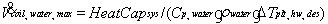

##### Zone Coils

Using the zone design coil inlet and supply air conditions calculate the design coil load.

If the coil is not part of an induction unit then obtain the coil inlet temperature from the zone design data array;

*Tin,air= DesHeatCoilInTempzone*

If the coil is part of an induction unit take into account the induced air:

*Fracminflow*=*MinFlowFraczone*

*Tin,air*= *DesHeatCoilInTempzone* *Fracminflow* +

*ZoneTempAtHeatPeak­zone*(1 *Fracminflow*)

*Tout,air=HeatDesTempzone*

W*out,air= HeatDesHumRatzone*

If the coil is part of a terminal unit the mass flow rate is determined by the volumetric flow rate of the terminal unit:

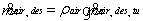

Otherwise the design flow is obtained from the zone design data array:

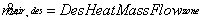

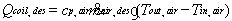

Here *cp,air* is calculated at the outlet humidity and the average of the inlet and outlet temperatures.

With the coil load and the user specified (in a Sizing:Plant object) design hot water temperature decrease, calculate the max water flow rate:

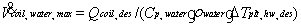

#### UA of the Coil

To obtain the UA of the coil, we specify the model inputs (other than the UA) at design conditions and the design coil load that the coil must meet. Then we numerically invert the coil model to solve for the UA that will enable the coil to meet the design coil load given the specified inputs.

##### System Coils

The design coil load is the system design sensible cooling capacity;

*Qcoil,des*= *HeatCapsys*

The required inputs for the simple coil model are:

*Tin,air*= *HeatMixTempsys*

*Win,air*= *HeatMixHumRatsys*

*Tin,water*= *ExitTempplt,hw,des*

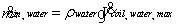

Depending on the duct type, get the coil design air flow rate.

For duct type = *main, other* or default

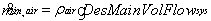

for duct type=*cooling*

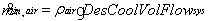

for duct type=*heating*

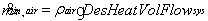

We now have all the data needed to obtain UA. The numerical inversion is carried out by calling subroutine *SolveRegulaFalsi*. This is a general utility routine for finding the zero of a function. In this case it finds the UA that will zero the residual function – the difference between the design coil load and the coil output divided by the design coil load. The residual is calculated in the function *SimpleHeatingCoilUAResidual*.

##### Zone Coils

If the coil is not part of an induction unit then obtain the coil inlet temperature from the zone design data array;

*Tin,air= DesHeatCoilInTempzone*

If the coil is part of an induction unit take into account the induced air:

*Fracminflow*=*MinFlowFraczone*

*Tin,air*= *DesHeatCoilInTempzone* *Fracminflow* +

*ZoneTempAtHeatPeak­zone*(1 *Fracminflow*)

*Win,air*= *DesHeatCoilInHumRatzone*

*Tin,water*= *ExitTempplt,hw,des*

*Tout,air=HeatDesTempzone*

W*out,air= HeatDesHumRatzone*

If the coil is part of a terminal unit the mass flow rate is determined by the volumetric flow rate of the terminal unit:

Otherwise the design flow is obtained from the zone design data array:

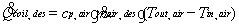

Here *cp,air* is calculated at the outlet humidity and the average of the inlet and outlet temperatures.

We now have all the data needed to obtain UA. The numerical inversion is carried out by calling subroutine *SolveRegulaFalsi*. This is a general utility routine for finding the zero of a function. In this case it finds the UA that will zero the residual function – the difference between the design coil load and the coil output divided by the design coil load. The residual is calculated in the function *SimpleHeatingCoilUAResidual*.

### Coil:Heating:Steam Sizing

The sizing is done in subroutine *SizeSteamCoil*.

#### Maximum Steam Flow Rate

##### System Coils

The maximum steam volumetric flow rate is calculated using:

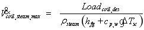

The steam density (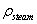) is for saturated steam at 100°C and *hfg* is the latent heat of vaporization of water at 100°C. *Cp,w* ** is the heat capacity of water (evaluated at the Design Loop Exit Temperature defined in the Sizing:Plant object) and 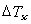 is the Degree of  Subcooling defined in the Coil:Heating:Steam object input. The design coil load *Loadcoil,des* is calculated from:

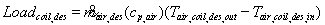

The design air mass flow rate depends on the location of the coil (duct type). For duct type =  *main,* the flow rate is set to *air**DesMainVolFlowsys**MinSysAirFlowRatio*. If the coil is in a cooling duct the flow rate is set to *air**DesCoolVolFlowsys**MinSysAirFlowRatio*. If the coil is in a heating duct the flow rate is set to *air**DesHeatVolFlowsys*. If the coil is in any other kind of duct, the flow rate is set to *air**DesMainVolFlowsys*.

For sizing, the design outlet air temperature (*Tair,coil,des,out*) is the Central Heating Design Supply Air Temperature specified in the Sizing:System object.

The design inlet air temperature depends on whether the coil is being sized for 100% outdoor air or minimum outdoor air flow (per 100% Outdoor Air in Heating input field in the Sizing:System object).

1.  Sizing based on 100% Outdoor Air in Heating

*Tair,coil,des,in* = *HeatOutTempsys* (the outdoor air temperature at the design heating peak)

1.  Sizing based on minimum outdoor air flow. The outdoor air fraction is calculated as *Frac*oa ** = *DesOutAirVolFlowsys* / *DesVolFlow*. *DesVolFlow* is 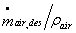*.*

*Tair,coil,des,in* =*Frac*oa** ** *HeatOutTempsys* + (1. *Fracoa*)*HeatRetTempsys* (see [Table 38.  System Sizing Data](#_Ref226429752))

##### Zone Coils

If the coil is part of an *AirTerminal:SingleDuct:\** unit (e.g., *AirTerminal:SingleDuct:ConstantVolume:Reheat,* *AirTerminal:SingleDuct:VAV:Reheat,* *AirTerminal:SingleDuct:SeriesPIU:Reheat, etc.)*, the maximum steam flow rate is set equal to the terminal unit’s maximum steam flow rate. Otherwise (e.g., the zone-level coil is part of *ZoneHVAC:PackagedTerminalAirConditioner, ZoneHVAC:UnitVentilator,* ** *ZoneHVAC:UnitHeater* *or ZoneHVAC:VentilatedSlab*) the calculation is similar to that at the system level. A design load is calculated:

where:

= *DesHeatMassFlowzone* (see [Table 37.  Zone Sizing Data](#_Ref226429779))

*Tair,coil,des,in* = *DesHeatCoilInTempzone* (see [Table 37](#_Ref226429800))

*Tair,coil,des,out* = *HeatDesTempzone* (user input from Sizing:Zone object)

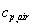 = Specific heat of air (evaluated at the average of inlet and outlet air temperatures, and at the zone heating design supply air humidity ratio *HeatDesHumRatzone* [user input from Sizing:Zone object])

The terms in the denominator of this equation (*ρsteam*, *hfg*, etc.) are evaluated in the same way as described above for steam System Coils.

### Sizing of Gas and Electric Heating Coils

The sizing calculation is done in subroutine *SizeHeatingCoil* in module *HeatingCoils*.

#### Nominal Capacity of the Coil

##### System Coils

The value is obtained from the system design array.

*Capnom*= *HeatCapsys*

##### Zone Coils

The capacity is calculated from the design coil inlet and outlet conditions.

If the coil is not part of an induction unit then obtain the coil inlet temperature from the zone design data array;

*Tin,air= DesHeatCoilInTempzone*

If the coil is part of an induction unit take into account the induced air:

*Fracminflow*=*MinFlowFraczone*

*Tin,air*= *DesHeatCoilInTempzone* *Fracminflow* +

*ZoneTempAtHeatPeak­zone*(1 *Fracminflow*)

*Tout,air=HeatDesTempzone*

W*out,air= HeatDesHumRatzone*

*Qcoil,des*=*Cp,air* *DesHeatMassFlowzone*(*Tout,air**Tin,air*)

Here *cp,air* is calculated at the outlet humidity and the average of the inlet and outlet temperatures.

### DX Coil Sizing

The sizing calculations are done in subroutine *SizeDXCoil* in module *DXCoils*. This section covers the sizing of the objects

1.  Coil:Cooling:DX:SingleSpeed
2.  Coil:Heating:DX:SingleSpeed
3.  Coil:Cooling:DX:TwoSpeed

#### Rated Air Volume Flow Rate

#### System Coils

The rated air flow rate is obtained from the system design array.

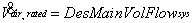

#### Zone Coils

The rated air flow rate is the maximum of the heating and cooling design flow rates from the zone design array.

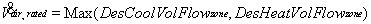

#### Rated Total Cooling Capacity

#### System Coils

The rated cooling capacity is obtained by dividing the peak cooling capacity by the *Cooling Capacity Modifier Curve* evaluated at peak mixed wetbulb and outdoor drybulb temperatures.

*Tmix*= *CoolMixTempsys*

*Wmix*=*CoolMixHumRatsys*

*Tsup*=*CoolSupTempsys*

*Wsup*=*CoolSupHumRatsys*

*Toutside*=*CoolOutTempsys*

*air*=*PsyRhoAirFnPbTdbW*(*pair,std*, *Tmix*,*Wmix*)

*hmix*= *PsyHFnTdbW*(*Tmix*,*Wmix*)

*hsup*= *PsyHFnTdbW*(*Tsup*,*Wsup*)

*Tmix,wb*= *PsyTwbFnTdbWPb*(*Tmix*,*Wmix*, *pair,std*)

*CapModFac*=*CurveValue*(CCapFTemp,*Tmix,wb*,*Toutside*)

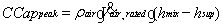

*CCaprated*=*CCappeak* *CapModFac*

We check that the design volume flow per total capacity is within the prescribed range:

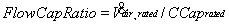

If *FlowCapRatio* \< *FlowCapRatiomin*  then

If *FlowCapRatio* \> *FlowCapRatiomax*  then

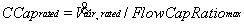

where

*FlowCapRatiomin* = 0.00004027 m3/s per watt (300 cfm/ton)

And

*FlowCapRatiomax*= 0.00006041 m3/s per watt (450 cfm/ton)

The sizing calculation for DX cooling coils for 100% dedicated outdor air system (DOAS) are identical to regular DX cooling coils.  However, they operate operate at different flow to capacity ratio ranges and are within the prescribed range below:

*FlowCapRatiomin* = 0.00001677 m3/s per Watt (125 cfm/ton)

And

*FlowCapRatiomax*= 0.00003355 m3/s per Watt (250 cfm/ton)

 

#### Zone Coils

The rated cooling capacity for zone coils is calculated in the same manner as for system coils.

*Tmix*= *DesCoolCoilInTempzone*

*Wmix*= *DesCoolCoilInHumRatzone*

*Tsup*= *CoolDesTempzone*

*Wsup*= *CoolDesHumRatzone*

*Toutside*=*Toutside,desday,peak*

*air*=*PsyRhoAirFnPbTdbW*(*pair,std*, *Tmix*,*Wmix*)

*hmix*= *PsyHFnTdbW*(*Tmix*,*Wmix*)

*hsup*= *PsyHFnTdbW*(*Tsup*,*Wsup*)

*Tmix,wb*= *PsyTwbFnTdbWPb*(*Tmix*,*Wmix*, *pair,std*)

*CapModFac*=*CurveValue*(CCapFTemp,*Tmix,wb*,*Toutside*)

*CCaprated*=*CCappeak* *CapModFac*

We check that the design volume flow per total capacity is within the prescribed range:

If *FlowCapRatio* \< *FlowCapRatiomin*  then

If *FlowCapRatio* \> *FlowCapRatiomax*  then

where

*FlowCapRatiomin* = 0.00004027 m3/s per watt (300 cfm/ton)

And

*FlowCapRatiomax*= 0.00006041 m3/s per watt (450 cfm/ton)

We check the design flow to the total cooling capacity rato for dedicated zone outdoor unit DX cooling coils to be within the limits prescribed below:

*FlowCapRatiomin* = 0.00001677 m3/s per Watt (125 cfm/ton)

And

*FlowCapRatiomax*= 0.00003355 m3/s per Watt (250 cfm/ton)

#### Rated Total Heating Capacity

For Coil:Heating:DX:SingleSpeed the rated heating capacity is set equal to the cooling capacity.

#### Rated SHR

The rated sensible heat ratio is calculated to be the sensible cooling (from rated inlet conditions to user specified supply conditions) divided by the total cooling (from rated inlet to specified supply).

*Tin,rated*= 26.6667 oC (80 oF)

*Win,rated*= 0.01125 (corresponds to 80 oF drybulb, 67 oF wetbulb)

*Cp,air*= *PsyCpAirFnWTdb*(*Win,rated*, *Tin,rated*)

For system coils

*Tsup*=*CoolSupTempsys*

*Wsup*=*CoolSupHumRatsys*

For zone coils

*Tsup*= *CoolDesTempzone*

*Wsup*= *CoolDesHumRatzone*

Then

*hrated*= *PsyHFnTdbW*(*Tin,rated*, *Win,rated*)

*hsup*= *PsyHFnTdbW*(*Tsup*, *Wsup*)

*h*rated,sup=*hrated**hsup*

*Qsrated,sup*=*Cp,air*(*Tin,rated**Tsup*)

*SHRrated*=*Qsrated,sup**h*rated,sup

#### Evaporative Condenser Air Volume Flow Rate

The evaporative condenser air volume flow rate (m3/s) is set to 0.000114 m3/s per watt (850 cfm/ton) times the total rated cooling capacity.

#### Evaporative Condenser Air Volume Flow Rate, Low Speed

The evaporative condenser air volume flow rate, low speed (m3/s) is set to 1/3 times 0.000114 m3/s per watt (850 cfm/ton) times the total rated cooling capacity.

#### Evaporative Condenser Pump Rated Power Consumption

The evaporative condenser pump rated power consumption is set equal to the total cooling capacity times 0.004266 watts pump power per watt capacity (15 W/ton).

#### Evaporative Condenser Pump Rated Power Consumption, Low Speed

The evaporative condenser pump rated power consumption, low speed, is set equal to 1/3 times the total cooling capacity times 0.004266 watts pump power per watt capacity (15 W/ton).

#### Rated Air Volume Flow Rate, low speed

The rated air volume flow rate, low speed, is set equal to 1/3 times the full rated air volume flow rate.

#### Rated Total Cooling Capacity, Low Speed

The rated total cooling capacity, low speed, is set equal to 1/3 times the full rated total cooling capacity.

#### Rated SHR, low speed

The rated sensible heat ratio, low speed, is set equal to the full speed SHR.

#### Resistive Defrost Heater Capacity

For the heat pump the resistive defrost heat capacity is set equal to the cooling capacity.

### DX MultiSpeed Coil Sizing

The sizing calculations are done in subroutine *SizeDXCoil* in module *DXCoils*. This section covers the sizing of the objects

-   Coil:Heating:DX:MultiSpeed
-   Coil:Cooling:DX: MultiSpeed

The rated air volume flow rate, rated total cooling capacity, rated heating capacity, rated SHR, evaporative condenser air volume flow rate, evaporative condenser pump rated power consumption at the highest speed are sized in the same ways as DX Coil Sizing.

After the sizes are determined at the highest speed, the sizes in the rest of speeds are assumed to

where

Valuen= Any autosizable variable at Speed n, except SHR

SHRn = SHRNumberOfSpeed

n= Speed Index number from 1 to NumberOfSpeed-1

NumberOfSpeed= The highest speed number

### Coil:Cooling:DX:VariableSpeed Sizing

For the variable-speed DX cooling coil, we specify a nominal speed level. During the sizing calculation, the Rated Total Cooling Capacity at the Selected Nominal Speed Level is determined in the same way as the Coil:Cooling:DX:SingleSpeed object. If the user chooses to autosize the Rated Air Volume Flow Rate, the flow rate, as compared to the Rated Total Cooling Capacity, is sized to have the same ratio as the air volume flow rate to the total cooling capacity at the nominal speed, of the Reference Unit. The sensible heat transfer rate is not allowed for auto-sizing, instead, it is a function of the rated air flow, rated total cooling capacity and the Reference Unit SHR at the nominal speed level. The default nominal speed level is the highest speed. However, the model allows the user to select a nominal speed level rather than the highest.

***Rated Total Cooling*** ***Capacity***

The calculation for coil operating temperatures (inlet and outlet) are identical to that done for Coil:Cooling:DX:SingleSpeed. The calculations for air enthalpy are similar to that done for Coil:Cooling:DX:SingleSpeed*.* The difference is in calculating the total cooling capacity temperature modifier function at the selected nominal speed level, as below:

where

WBi = wet-bulb temperature of the air entering the cooling coil, °C

DBo = condenser entering air temperature, °C

a-f = regression curve-fit coefficients.

If the entering air enthalpy is less than the exiting air enthalpy, a reference value of 48,000 J/kg is used as the entering air enthalpy. If the *TotCapTempModFac* calculation above yields 0 as the result, a value of 1 is used in the following calculation. If the rated air mass flow rate is determined to be less than a very small flow value (0.001 kg/s) or the capacity calculated here is less than 0, the coil total cooling capacity is set equal to 0.

*If Hin* *\> Hout* *Then*

*Else*

*End If*

The other sizing procedures, e.g. evaporative condenser pump, etc., are the same as Coil:Cooling:DX:SingleSpeed.

### Coil:Heating:DX:VariableSpeed Sizing

For the variable-speed DX heating coil, we specify a nominal speed level. During the sizing calculation, the Rated Heating Capacity at the Selected Nominal Speed Level should be the same as the total cooling capacity of its corresponding cooling coil, which has to be sized first. The default nominal speed level will be the highest speed. However, the model allows the user to select a nominal speed level rather than the highest. If the user chooses to autosize the Rated Air Volume Flow Rate, the flow rate, as compared to the Rated Heating Capacity, is sized to have the same ratio as the air volume flow rate to the heating capacity at the nominal speed, of the Reference Unit. The other sizing procedures are the same as Coil:Heating:DX:SingleSpeed.

### Pump Sizing

The loop pumps’ autosizable inputs are nominal volumetric flow rate and nominal power consumption. We have

*Efftot*=*Effmot**Effimpeller*

The motor efficiency is an input. Since we need the total efficiency to calculate the nominal power consumption we assume an impeller efficiency of 0,78 for purposes of sizing.

#### Rated Volumetric Flow Rate

This is just set equal to the design loop demand obtained from summing the needs of the components on the demand side of the loop.

#### Rated Power Consumption

*Hnom*, the nominal head, is an input.

### Electric Chiller Sizing

Generally chillers will need nominal cooling capacity, evaporator flow rate and condenser flow rate. All 3 quantities can be straightforwardly obtained using the user specified loop sizing data and the loop design flow rates.

All chillers on a loop are sized to meet the full loop load. If there are multiple chillers on a loop that call for autosizing, they will all be assigned the same cooling capacity and evaporator flow rate.

#### Nominal Cooling Capacity

where

*Cp,w* is the specific heat of water at 5 oC;

*w* is the density of water at standard conditions (5.05 oC);

*Tloop,des* is the chilled water loop design temperature rise;

is the loop design volumetric flow rate.

#### Design Evaporator Volumetric Water Flow Rate

#### Design Condenser Volumetric Water Flow Rate

where

*Cp,w* is the specific heat of water at design condenser inlet temperature;

*w* is the density of water at standard conditions (5.05 oC);

*Tloop,des* is the chilled water loop design temperature rise;

*COPchiller,nom* is the chiller nominal COP.

Boiler Sizing

Generally boilers will need nominal heating capacity and rate. Both quantities can be straightforwardly obtained using the user specified loop sizing data and the loop design flow rates.

All boilers on a loop are sized to meet the full loop load. If there are multiple boilers on a loop that call for autosizing, they will all be assigned the same heating capacity and flow rate.

#### Nominal Capacity

where

*Cp,w* is the specific heat of water at the boiler design outlet temperature;

*w* is the density of water at standard conditions (5.05 oC);

*Tloop,des* is the hot water loop design temperature decrease;

is the loop design volumetric flow rate.

#### Design Evaporator Volumetric Water Flow Rate

### Plant Heat Exchanger Sizing

The sizing of plant heat exchanger component (object: HeatExchanger:FluidToFluid) involves determining design flow rates for both sides, a UA value, and a nominal capacity for reporting.  The component has a sizing factor for fine control and uses the design temperatures defined in the Sizing:Plant object.

The Loop Supply Side design flow rate, , is set equal to the design flow rate for that loop, multiplied by the component sizing factor, .

The Loop Demand Side design flow rate, , is set equal to the Loop Supply Side design flow rate.

The design heat transfer capacity and UA for the heat exchanger are calculated using the design temperatures for the two plant loops.  The loop design temperature difference for the Loop Supply Side, , is used to determine a nominal capacity.

A loop-to-loop design temperature difference, , is determined depending on the nature of the plant loop connected to the Loop Supply Side.  The Sizing:Plant object includes  classifications for the type of loop that include Heating, Steam, Cooling, or Condenser. For Cooling and Condenser loop types, the loop design temperature difference is added to the design exit temperature for the Loop Supply Side, .  For Heating and Stem loop types, the loop design temperature difference is subtracted from the design exit temperature.  This adjusted supply side temperature is then compared to the design exit temperature for the Loop Demand Side, .

    (Cooling, Condenser)

    (Heating, Steam)  

The UA (U-Factor Time Area Value) is determined by assuming that the target capacity can be delivered for the loop-to-loop temperature difference which after substituting and rearranging becomes:

A nominal capacity for the heat exchanger is determined from the design flow rates and UA (regardless of if they were automatically sized or input by the user) and the expected operating temperatures of the two loops.  The loop operating temperatures are obtained from the input in Sizing:Plant object if it is present for that loop.  If no Sizing:Plant is present then the loop’s overall setpoint is used (if the loop’s load scheme is DualSetpointDeadband then the average of the high and low setpoints is used).  The full heat exchanger model is then calculated for the maximum loop flow rates and expected loop temperatures as inlets to the heat exchanger.  The absolute value for the model result for heat transfer rate is then used as the capacity of the heat exchanger.  This capacity is reported and may be used for controls based on operation scheme.

### Humidifier Sizing

The rated power, or nominal electric power input of an Electric Steam Humidifier (Humidifier:Steam:Electric) is calculated from user specified rated capacity (m3/s) and the enthalpy change of the water from a reference temperature (20.0°C) to saturated steam at 100.0°C. Autosizing procedure assumes that electrical heating element in the humidifier heat the water from the reference temperature and generate saturated steam at 100°C, and electric to thermal energy conversion efficiency of 100.0%.

#### Rated Power

where

*Cp,w* *is the specific heat of water at average temperature ((100+20)/2 = 60.0* *°C), (J/kgK);*

*w* *is the density of water at standard conditions (5.05* *°C);*

*Tw* ** *is the sensible temperature rise of water (100.0 – 20.0=80.0* *°C);*

 *is the rated capacity of the humidifier in volumetric flow rate.*

*hfg* *is the* *latent heat of vaporization of water at 100.0°C, (J/kg);*

### Cooling Tower Sizing

The quantities needed to autosize a cooling tower include the design water flow rate, the nominal fan power and air flow rate, and the tower UA. This data may be need to be given at more than one operating point:, for instance – high speed fan, low speed fan and free convection.

EnergyPlus provides two input choices: the user can input the design water flow rate and tower UA at each operating point or the tower nominal capacity (and let the program calculate the water flow rate and UA). Choice of input method will affect the sizing calculations in ways noted below.

#### Design Water Flow Rate

If *Tower Performance Input Method* = *UFactorTimesAreaAndDesignWaterFlowRate* then

If *Tower Performance Input Method* = *NominalCapacity* then

where 5.38210-08 is m3/s per watt corresponds to the rule-of-thumb of sizing the tower flow rate at 3 gallons per minute per ton.

#### Fan Power at Design Air Flow Rate

The nominal fan power is sized to be 0.0105 times the design load.

If *Tower Performance Input Method* = *UFactorTimesAreaAndDesignWaterFlowRate* then

where

*Cp,w* is the specific heat of water at the condenser loop design exit temperature;

*w* is the density of water at standard conditions (5.05 oC);

*Tloop,des* is the condenser water loop design temperature rise;

Finally

#### Design Air Flow Rate

We assume a fan efficiency of 0.5 and a fan pressure rise of 190 Pascals. Then

where

air is the density of air at standard conditions.

#### Tower UA Value at Design Air Flow Rate

To obtain the UA of the tower, we specify the model inputs (other than the UA) at design conditions and the design tower load that the tower must meet. Then we numerically invert the tower model to solve for the UA that will enable the tower to meet the design tower load given the specified inputs.

The design tower load is:

for *Tower Performance Input Method* = *UFactorTimesAreaAndDesignWaterFlowRate*

for *Tower Performance Input Method* = *NominalCapacity*

(to allow for compressor heat)

Then we assign the inputs needed for the model.

*Tin,air*=35 oC (95 oF design air inlet temperature)

*Tin,air,wb*=25.6 oC (78 oF design air inlet wetbulb temperature)

*Win* is calculated from the entering air drybulb and wetbulb.

The  inlet water mass flow rate is just the design eater volumetric flow rate times the density of water.

The inlet water temperature is set slightly differently for the 2 input methods. For

*UFactorTimesAreaAndDesignWaterFlowRate*

*Tin,water*=*Tloop,exit,des**Tloop,des*

*NominalCapacity*

*Tin,water*=35 oC (95 oF design inlet water temperature).

We now have all the data needed to obtain UA. The numerical inversion is carried out by calling subroutine *SolveRegulaFalsi*. This is a general utility routine for finding the zero of a function. In this case it finds the UA that will zero the residual function – the difference between the design tower load and the tower output divided by the design tower load. The residual is calculated in the function *SimpleTowerUAResidual.*

#### Air Flow Rate at Low Fan Speed

The nominal air flow rate at low fan speed is set to one-half of the full speed air flow rate.

#### Fan Power at Low Fan Speed

The fan power at low fan speed is set to 0.16 times the fan power at full speed.

#### Tower UA Value at Low Fan Speed

For *Tower Performance Input Method* = *UFactorTimesAreaAndDesignWaterFlowRate* the low speed UA is set to 0.6 times the full speed UA. For *Tower Performance Input Method* = *NominalCapacity* the low speed UA is calculated in the same manner as the full speed UA using  instead of .

#### Air Flow Rate in Free Convection Regime

The free convection air flow rate is set to 0.1 times the full air flow rate.

#### Tower UA Value in Free Convection Regime

For *Tower Performance Input Method* = *UA and Design Water Flow Rate* the low speed UA is set to 0.1 times the full speed UA. For *Tower Performance Input Method* = *NominalCapacity* the low speed UA is calculated in the same manner as the full speed UA using  instead of .

### Fluid Cooler Sizing

The quantities needed to autosize a fluid cooler include the design water flow rate, the nominal fan power, air flow rate, and the fluid cooler UA. This data may need to be given at more than one operating point:, for instance – high speed fan and low speed fan.

EnergyPlus provides two input choices: the user can input the design water flow rate and fluid cooler UA at each operating point or the fluid cooler nominal capacity and the water flow rate (and let the program calculate UA). Choice of input method will affect the sizing calculations in ways noted below.

#### Design Water Flow Rate

The design water flow rate is sized as follows

#### Fan Power at Design Air Flow Rate

The nominal fan power is sized to be 0.0105 times the design load.

If *Performance Input Method* = *UFactorTimesAreaAndDesignWaterFlowRate* then

  where

*  Cp,w* is the specific heat of water at the condenser loop design exit temperature;

* * *w* is the density of water at standard conditions (5.05 oC);

* * *Tloop,des* is the condenser water loop design temperature rise;

  Finally

#### Elseif Performance Input Method = NominalCapacity then

      

  Where   

       is provided by the user.

#### Design Air Flow Rate

-   For Performance Input Method = UFactorTimesAreaAndDesignWaterFlowRate

  

-   For Performance Input Method = NominalCapacity

   is provided by the user.

  

Where,

*Tin,water  * = Design entering water temperature provided by the user

*Tin,air       * = Design air inlet temperature provided by the user

#### Fluid cooler UA Value at Design Air Flow Rate

To obtain the UA of the fluid cooler, we specify the model inputs (other than the UA) at design conditions and the design fluid cooler load that the fluid cooler must meet. Then we numerically invert the fluid cooler model to solve for the UA that will enable the fluid cooler to meet the design fluid cooler load given the specified inputs.

The design fluid cooler load is:

-   For Performance Input Method = UFactorTimesAreaAndDesignWaterFlowRate

  

-   For Performance Input Method = NominalCapacity

   is provided by the user.

Then we assign the inputs needed for the model.

*Tin,air      * = Design air inlet temperature provided by the user

*Tin,air,wb* = Design air inlet wetbulb temperature provided by the user

*Win* is calculated from the entering air drybulb and wetbulb.

The  inlet water mass flow rate is just the design entering volumetric flow rate times the density of water.

The inlet water temperature is set slightly differently for the 2 input methods. For

-   UFactorTimesAreaAndDesignWaterFlowRate

-   NominalCapacity

We now have all the data needed to obtain UA. The numerical inversion is carried out by calling subroutine *SolveRegulaFalsi*. This is a general utility routine for finding the zero of a function. In this case it finds the UA that will zero the residual function – the difference between the design fluid cooler load and the fluid cooler output divided by the design fluid cooler load. The residual is calculated in the function *SimpleFluidCoolerUAResidual.*

#### Air Flow Rate at Low Fan Speed

The nominal air flow rate at low fan speed is set to one-half of the full speed air flow rate.

#### Fan Power at Low Fan Speed

The fan power at low fan speed is set to 0.16 times the fan power at full speed.

#### Fluid cooler UA Value at Low Fan Speed

For *Performance Input Method* = *UFactorTimesAreaAndDesignWaterFlowRate* the low speed UA is set to 0.6 times the full speed UA. For *Performance Input Method* = *NominalCapacity* the low speed UA is calculated in the same manner as the full speed UA using  instead of .

### Evaporative Fluid cooler Sizing

The quantities needed to autosize an evaporative fluid cooler include the design water flow rate, the nominal fan power, air flow rate, and the fluid cooler UA. This data may need to be given at more than one operating point:, for instance – high speed fan and low speed fan.

EnergyPlus provides three input choices: the user can input the design water flow rate and fluid cooler UA at each operating point (*UFactorTimesAreaAndDesignWaterFlowRate*) or the fluid cooler design capacity and the water flow rate and let the program calculate UA (*UserSpecifiedDesignCapacity*) or only the fluid cooler design capacity and let the program calculate UA and the water flow rate (*StandardDesignCapacity*). Choice of input method will affect the sizing calculations in ways noted below.

#### Design Water Flow Rate

If *Performance Input Method* = *StandardDesignCapacity* then

Else

where 5.38210-08 is m3/s per watt corresponds to the rule-of-thumb of sizing the fluid cooler flow rate at 3 gallons per minute per ton.

#### Fan Power at Design Air Flow Rate

The design fan power is sized to be 0.0105 times the design load.

If *Performance Input Method* = *UFactorTimesAreaAndDesignWaterFlowRate* then

  where

*Cp,w* is the specific heat of water at the condenser loop design exit temperature;

*w* is the density of water at standard conditions (5.05 oC);

*Tloop,des* is the condenser water loop design temperature rise;

  Finally

#### Else

      

  Where

      is the design capacity provided by the user for the other two performance

       input methods

#### Design Air Flow Rate

We assume a fan efficiency of 0.5 and a fan pressure rise of 190 Pascals. Then

where

air is the density of air at standard conditions.

#### Fluid cooler UA Value at Design Air Flow Rate

To obtain the UA of the evaporative fluid cooler, we specify the model inputs (other than the UA) at design conditions and the design fluid cooler load that the fluid cooler must meet. Then we numerically invert the fluid cooler model to solve for the UA that will enable the fluid cooler to meet the design fluid cooler load given the specified inputs.

The design fluid cooler load is:

-   For Performance Input Method = UFactorTimesAreaAndDesignWaterFlowRate

  

 

-   For Performance Input Method = StandardDesignCapacity

   (to allow for compressor heat)

         Then we assign the inputs needed for the model.

*     Tin,air      * = 35 oC (95 oF design air inlet temperature)

*     Tin,air,wb* = 25.6 oC (78 oF design air inlet wetbulb temperature)

*     Win* is calculated from the entering air drybulb and wetbulb.

 

-         For Performance Input Method = UserSpecifiedDesignCapacity

  

          Then we assign the inputs needed for the model.

*      Tin,air      * = Design air inlet temperature provided by the user

*      Tin,air,wb* = Design air inlet wetbulb temperature provided by the user

*      Win* is calculated from the entering air drybulb and wetbulb.

 

The inlet water mass flow rate is just the design entering volumetric flow rate times the density of water.

The inlet water temperature is set slightly differently for the 3 input methods. For

-   UFactorTimesAreaAndDesignWaterFlowRate

-   StandardDesignCapacity

-   UserSpecifiedDesignCapacity

 

We now have all the data needed to obtain UA. The numerical inversion is carried out by calling subroutine *SolveRegulaFalsi*. This is a general utility routine for finding the zero of a function. In this case it finds the UA that will zero the residual function – the difference between the design fluid cooler load and the fluid cooler output divided by the design fluid cooler load. The residual is calculated in the function *SimpleEvapFluidCoolerUAResidual.*

#### Air Flow Rate at Low Fan Speed

The design air flow rate at low fan speed is set to one-half of the full speed air flow rate.

#### Fan Power at Low Fan Speed

The fan power at low fan speed is set to 0.16 times the fan power at full speed.

#### Fluid cooler UA Value at Low Fan Speed

For *Performance Input Method* = *UFactorTimesAreaAndDesignWaterFlowRate* the low speed UA is set to 0.6 times the full speed UA. For *Performance Input Method* = *StandardDesignCapacity* (and similarly for *UserSpecifiedDesignCapacity* *method*) the low speed UA is calculated in the same manner as the full speed UA using  instead of .

### Fan Coil Unit Sizing

Fan Coil units are compound components: each unit contains a fan, hot water coil, chilled water coil and outside air mixer. The inputs that may need to be autosized are the nominal unit air flow rate, the maximum hot and chilled water flow rates, and the design outside air flow rate. The data needed for sizing the units is obtained from the zone design arrays and the user specified plant sizing input.

#### Maximum Air Flow Rate

#### Maximum Outside Air Flow Rate

#### Maximum Hot Water Flow

*Tcoil,in*=*DesHeatCoilInTempzone*

*Tcoil,out*=*HeatDesTempzone*

where

*cp,air* is evaluated at the average of the inlet & outlet temperatures and the coil outlet humidity ratio.

#### Maximum Cold Water Flow

*Tcoil,in*=*DesColdCoilInTempzone*

*Tcoil,out*=*ColdDesTempzone*

*Wcoil,in*= *DesCoolCoilInHumRatzone*

*Wcoil,out*= *CoolDesHumRatzone*

*Hcoil,in*= *PsyHFnTdbW*(*Tcoil,in*, *Wcoil,in*)

*Hcoil,out*= *PsyHFnTdbW*(*Tcoil,out*, *Wcoil,out*)

where

*cp,air* is evaluated at the average of the inlet & outlet temperatures and the coil outlet humidity ratio.

### Window Air Conditioner Sizing

Window air conditioners are compound components: each unit contains a fan, a DX coil and an outside air mixer. The inputs that may need to be autosized are the nominal unit air flow rate and the design outside air flow rate. The data needed for sizing the units is obtained from the zone design arrays.

#### Maximum Air Flow Rate

#### Maximum Outside Air Flow Rate

### Unit Ventilator Sizing

Unit ventilators are compound components: each unit contains an outdoor air mixer, a fan, a heating coil, and a cooling coil. The inputs that may need to be autosized are the maximum supply air flow rate and the maximum/minimum outside air flow rates. The data needed for sizing the units is obtained from the zone design arrays.

#### Maximum Air Flow Rate

If both the cooling and heating coil are present, then:

If only the heating coil is present, then:

If only cooling coil is present, then:

If neither heating nor cooling coil is present, then:

#### Maximum Outside Air Flow Rate

#### Minimum Outside Air Flow Rate

### Packaged Terminal Heat Pump Sizing

Packaged terminal heat pumps are compound components: each unit contains a supply air fan, a DX cooling coil, a DX heating coil, a GAS or ELECTRIC supplemental heating coil, and an outside air mixer. The inputs that may need to be autosized are the supply air and outside air volumetric air flow rates during cooling operation, heating operation, and when no cooling or heating is needed. In addition, the maximum supply air temperature from the supplemental heater can also be automatically selected. The data needed for sizing the units are obtained from the zone design arrays.

#### Supply air volumetric flow rate during cooling operation

#### Supply air volumetric flow rate during heating operation

#### Supply air volumetric flow rate when no cooling or heating is needed

#### Outside air volumetric flow rate during cooling operation

#### Outside air volumetric flow rate during heating operation

#### Outside air volumetric flow rate when no cooling or heating is needed

#### Maximum supply air temperature from supplemental heater

### MultiSpeed Heat Pump Sizing

MultiSpeed heat pumps are compound components: each unit contains a supply air fan, a multispeed DX cooling coil, a multispeed DX heating coil, and a GAS or ELECTRIC supplemental heating coil. The inputs that may need to be autosized are the supply air volumetric air flow rates during cooling operation, heating operation, and when no cooling or heating is needed. The data needed for sizing the units are obtained from the controlled zone design arrays.

#### Supply air volumetric flow rate during cooling operation at the highest speed

#### Supply air volumetric flow rate during heating operation at the highest speed

#### Supply air volumetric flow rate when no cooling or heating is needed

where

ZoneFraction = Fraction of the total volume flow that goes through the controlling zone

#### Supply air volumetric flow rate during cooling operation at Speed n (1 to NumberOfSpeed-1)

#### Supply air volumetric flow rate during heating operation at Speed n (1 to NumberOfSpeed-1)

where

n= Speed Index number from 1 to NumberOfSpeed-1

NumberOfSpeed= The highest speed number

### Single Duct Terminal Units

These are all the EnergyPlus components whose names begin with "*AirTerminal:SingleDuct:*" (except for Cooled Beam units). This includes *Uncontrolled, ConstantVolume:Reheat, VAV:NoReheat, VAV:Reheat,* *VAV:Reheat:VariableSpeedFan,* *VAV:HeatAndCool:NoReheat,* *VAV:HeatAndCool:Reheat,* *SeriesPIU:Reheat,* *ParallelPIU:Reheat,* and *ConstantVolume:FourPipeInduction*. The inputs that may need to be autosized are the various maximum air flow rates through the unit, minimum air flow rates, and maximum hot water and/or chilled water flow rates if heating or cooling coils are present.

*Note:* all zone design flow rates and loads referenced below may have been altered by system sizing inputs. For instance, if the user specifies a *Cooling Design Air Flow Method* *= Flow/System* and specifies a *Cooling Design Air Flow Rate* ** the zone cooling design values will be altered to match the specified system flow rate.

#### Maximum Air Flow Rate

#### Maximum Heating Air Flow Rate

#### Maximum Primary and Secondary Air Flow Rates

For the PIU terminal units, the maximum primary and secondary air flow rates are sized to the same value as the maximum total air flow rate.

#### Minimum Air Flow Rate

Basically minimum air flow rates are sized to the ventilation air requirement. This may be more or less complicated.

For the PIU's, the minimum primary air flow fraction is set to

.

For other VAV terminal units

where, *Fracair,min* corresponds to the minimum flow fraction of the teminal unit. This value is provided as user input, typically as the field “Zone Minimum Air Flow Fraction.” For the VAV terminals that allow scheduling minimum flow fraction (e.g., AirTerminal:SingleDuct:VAV:Reheat), there are two ways that *Fracair,min* can be determined. If a value is entered in the input field Constant Minimum Air Flow Fraction, then it is always used for *Fracair,min*. If the mimimum air flow fraction method is “Schedule” and the Constant Minimum Air Flow Fraction is left blank, then the program uses the average of the minimum and maximum values in the schedule for *Fracair,min*.

#### Fan On Flow Fraction

For the parallel PIU, this is set to the minimum primary air flow fraction.

#### Max Hot  Water Flow

The coil load and max hot water flow rate are then:

where

*cp,air* is evaluated at the average of the inlet & outlet temperatures and the coil outlet humidity ratio.

The four-pipe induction unit sizes the heating coil differently: to meet the zone load rather than match the design zone supply temperature. The load on the hot water coil is then the zone load minus whatever the central system does.

where

#### Max Chilled Water Flow

The chilled water flow for the four-pipe induction unit is sized analogously to the hot water flow.

### Indirect Evaporative Cooler Sizing

The model for the object called EvaporativeCooler:Indirect:ResearchSpecial has a field for the secondary fan flow rate that can be autosized. 

#### Secondary Fan Flow Rate

The secondary fan is not part of an airstream that is directly modeled in EnergyPlus.  Because the primary side air flows can be autosized as part of the air system, it is convenent to also scale the size of the secondary flow.   If the cooler is part of the main loop of a central air system, then the secondary fan flow rate is sized to equal to the main design flow rate. 

If the cooler is part of the outdoor air path of a central air system, then the secondary fan flow rate is sized to be the maximum of either the design minimum outdoor air flow rate or one-half of the main design flow rate.

Zone Outdoor Air Design Data
----------------------------

Outdoor air design data may be required for many aspects of a building computer model. Sizing of HVAC equipment, infiltration and ventilation, and specific outdoor air requirements for different zone types are a few examples where required outdoor air quantities may vary. Since there would be a significant chance for data input errors if each individual aspect of the simulation model allowed for independent input of outdoor air design data, this general object is used to define outdoor air design data and this data set may be used throughout the building simulation model.

The design data is provided as a group of inputs that are recognized by designers as standard practice. This information may be used individually or used as a group to calculate summations or maximums of the entered data. These design data include values for:

-   Outdoor air per person
-   Outdoor air per zone floor area
-   Outdoor air per zone
-   Outdoor air changes per hour

This design data is entered in an outdoor air design data object and may be referenced by other objects during the simulation. A single specification for outdoor air design data may be used by all other appropriate objects within EnergyPlus, or multiple outdoor air design data objects may be specified and these design data objects may be used as necessary by other objects when outdoor air design quantaties vary for any reason.

### Design Outdoor Air Calculation

The outdoor air design data is entered as a group and referenced through name association to this group of design data (Ref. DesignSpecification:OutdoorAir). The reference name in the following example is “ZoneOAData”.

A DesignSpecification:OutdoorAirexample:

DesignSpecification:OutdoorAir,

    ZoneOAData,            !- Name

    Maximum,               !- Outdoor Air Method

    0.00944,               !- Outdoor Air Flow per Person {m3/s}

    0.00305;               !- Outdoor Air Flow per Zone Floor Area {m3/s-m2}

    ,                      !- Outdoor Air Flow per Zone

    ,                      !- Outdoor Air Flow Air Changes per Hour

    Min OARequirements Sched; !- Outdoor Air Flow Rate Fraction Schedule Name

Given this set of data, the quantity of outdoor air is calculated based on the Outdoor Air Method specified in each outdoor air design data object. In this example, the maximum of the per person and per zone floor area is used to establish the outdoor air quantity.

As previously mentioned, this group of outdoor air design data is reference by other objects used in the simulation. The reference is by the *name* of the outdoor air design data object. Any reference to this name by other objects simply means that the object referencing this data set will use the values specified in this common object. Note that a zone name is not included in the list of data and the calculation of occupancy, zone floor area, or zone volume is implied through this named reference and *the connection to a zone via the referencing object*. For example, if a terminal unit references an outdoor air design data object, the zone served by that terminal unit is used to determine the occupancy, zone floor area, and zone volume in the following calculations.

where:

= outdoor air volume flow rate based on occupancy, [m3/s]

= number of occupants in zone, [people]

= outdoor air volume flow rate per person, [m3/s-person]

= outdoor air volume flow rate based on zone floor area, [m3/s]

= zone floor area, [m2]

= outdoor air volume flow rate per zone floor area, [m3/s-m2]

= zone outdoor air volume flow rate, [m3/s]

= outdoor air volume flow rate per zone, [m3/s]

= outdoor air volume flow rate based on air changes per hour, [m3/s]

= zone volume, [m3]

= outdoor air volume flow in air changes per hour, [m3/s-m3]

Given the calculations for each specific type of design data, the method used to calculate the outdoor air design data is then based on a user selected method for this specific outdoor air design data object. The outdoor air methods used to calculate the outdoor air quantity and the associated value for outdoor air volume flow rate are shown here.

Flow/Person =\> 

Flow/Area =\> 

Flow/Zone =\> 

AirChanges/Hour =\> 

Sum =\> 

Maximum =\> 

If an Outdoor Air Flow Rate Fraction Schedule Name is specified, the flow rate determined above will be multiplied by the current schedule value.

Examples of objects that reference the outdoor air design data object are:

-   AirTerminal:SingleDuct:VAV:NoReheat
-   AirTerminal:SingleDuct:VAV:Reheat

### References

ASHRAE Fundamentals 2001. 2001 ASHRAE Fundamentals Handbook. Atlanta: American Society of Heating, Refrigerating and Air-Conditioning Engineers, Inc.

Pedersen, C.O., D.E. Fisher, and R.J. Liesen. 1997. A heat balance based cooling load calculation procedure. ASHRAE Transactions, Vol. 103(2), pp. 459-468.

Pedersen, C.O. 2001. Toolkit for Building Load Calculations. Atlanta: American Society of Heating, Refrigerating and Air-Conditioning Engineers, Inc.

